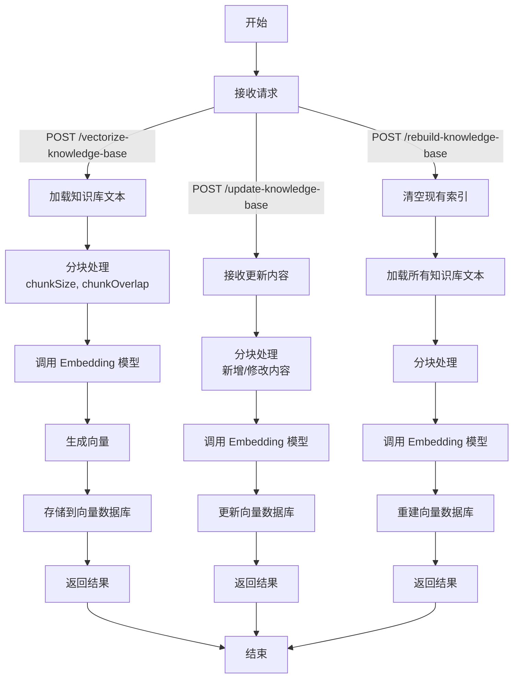

1、知识库数据向量化：
- 将知识库中的文本内容进行分块 (Chunking)。
- 使用Embedding模型将每个文本块转换为向量。
- 将文本块及其对应的向量存储到向量数据库中。
2、知识库更新与索引重建：
- 当知识库内容发生变化时，需要重新进行向量化和索引。
- 可以采用增量更新或定时全量更新的策略。

使用nodejs 实现这两个功能并画出流程图或者数据流转图
1、只需要设计对外的接口，不需要具体的实现代码


### 1. 知识库数据向量化接口设计

#### 功能描述
- **分块 (Chunking)**：将知识库中的文本内容分割为小块。
- **向量化 (Embedding)**：使用 Embedding 模型将文本块转换为向量。
- **存储**：将文本块及其向量存储到向量数据库中。

#### 接口设计
1. **接口名称**：`/vectorize-knowledge-base`
   - **方法**：POST
   - **描述**：对知识库中的文本内容进行向量化并存储。
   - **请求参数**：
     - `knowledgeBaseId` (string, required)：知识库的唯一标识。
     - `texts` (array of strings, required)：知识库中的文本内容列表。
     - `chunkSize` (number, optional)：分块大小，默认 1000 字符。
     - `chunkOverlap` (number, optional)：块间重叠大小，默认 200 字符。
   - **返回结果**：
     - `status` (string)：操作状态（"success" 或 "error"）。
     - `message` (string)：操作结果描述。
     - `vectorCount` (number)：成功向量化的文本块数量。
   - **示例请求**：
     ```json
     {
       "knowledgeBaseId": "kb123",
       "texts": ["这是一段很长的文本内容...", "另一段文本..."],
       "chunkSize": 1000,
       "chunkOverlap": 200
     }
     ```
   - **示例返回**：
     ```json
     {
       "status": "success",
       "message": "知识库向量化完成",
       "vectorCount": 10
     }
     ```

#### 数据流转
1. 接收请求中的文本内容。
2. 使用分块算法（类似 LangChain 的 `Text Splitter`）将文本分割为小块。
3. 调用 Embedding 模型（例如通过 API 调用 OpenAI 的 `text-embedding-ada-002`）生成向量。
4. 将文本块和向量存储到向量数据库（如 Pinecone、Weaviate 或 Milvus）。

---

### 2. 知识库更新与索引重建接口设计

#### 功能描述
- **增量更新**：仅对知识库中新增或修改的内容进行向量化并更新索引。
- **定时全量更新**：定时对整个知识库重新向量化并重建索引。

#### 接口设计
1. **增量更新接口**：`/update-knowledge-base`
   - **方法**：POST
   - **描述**：增量更新知识库，向量化新增或修改的内容并更新索引。
   - **请求参数**：
     - `knowledgeBaseId` (string, required)：知识库的唯一标识。
     - `updatedTexts` (array of objects, required)：新增或修改的文本内容。
       - `id` (string)：文本块的唯一标识（用于更新）。
       - `content` (string)：文本内容。
     - `chunkSize` (number, optional)：分块大小，默认 1000 字符。
     - `chunkOverlap` (number, optional)：块间重叠大小，默认 200 字符。
   - **返回结果**：
     - `status` (string)：操作状态（"success" 或 "error"）。
     - `message` (string)：操作结果描述。
     - `updatedCount` (number)：更新的文本块数量。
   - **示例请求**：
     ```json
     {
       "knowledgeBaseId": "kb123",
       "updatedTexts": [
         { "id": "text1", "content": "更新后的文本内容..." },
         { "id": "text2", "content": "新增的文本内容..." }
       ],
       "chunkSize": 1000,
       "chunkOverlap": 200
     }
     ```
   - **示例返回**：
     ```json
     {
       "status": "success",
       "message": "增量更新完成",
       "updatedCount": 2
     }
     ```

2. **定时全量更新接口**：`/rebuild-knowledge-base`
   - **方法**：POST
   - **描述**：对整个知识库进行全量向量化并重建索引。
   - **请求参数**：
     - `knowledgeBaseId` (string, required)：知识库的唯一标识。
     - `chunkSize` (number, optional)：分块大小，默认 1000 字符。
     - `chunkOverlap` (number, optional)：块间重叠大小，默认 200 字符。
   - **返回结果**：
     - `status` (string)：操作状态（"success" 或 "error"）。
     - `message` (string)：操作结果描述。
     - `vectorCount` (number)：重建后的向量数量。
   - **示例请求**：
     ```json
     {
       "knowledgeBaseId": "kb123",
       "chunkSize": 1000,
       "chunkOverlap": 200
     }
     ```
   - **示例返回**：
     ```json
     {
       "status": "success",
       "message": "全量重建完成",
       "vectorCount": 50
     }
     ```

#### 数据流转
- **增量更新**：
  1. 接收新增或修改的文本内容。
  2. 对这些文本进行分块和向量化。
  3. 更新向量数据库中的对应记录（基于文本 ID）。
- **全量更新**：
  1. 清空现有向量数据库中的记录（或创建新索引）。
  2. 加载知识库中的所有文本内容。
  3. 进行分块、向量化，并存储到向量数据库。

---

### 流程图（使用 Mermaid 语法）

以下是数据流转图的 Mermaid 代码，描述了知识库向量化与更新的流程：



#### 流程图说明
1. **节点**：
   - `A` 到 `T` 分别表示流程中的步骤。
   - 分支路径表示三种接口的处理流程：向量化 (`/vectorize-knowledge-base`)、增量更新 (`/update-knowledge-base`) 和全量重建 (`/rebuild-knowledge-base`)。
2. **箭头**：
   - `-->|` 说明接口调用或数据流转。
   - 每个路径最终汇聚到 `结束`。
3. **渲染**：
   - 您可以将此代码粘贴到 Mermaid Live Editor（https://mermaid.live/）查看图形。

---

### 当前时间上下文
当前时间为 2025年5月26日凌晨 03:27 PDT（太平洋夏令时）。Node.js 生态在此时依然是 Web 开发的热门选择，LangChain 的 JavaScript 版本（`langchainjs`）也支持类似的分块和向量化功能，可以通过其 API 实现上述接口。

如果您需要进一步调整接口参数或流程图样式，请告诉我！